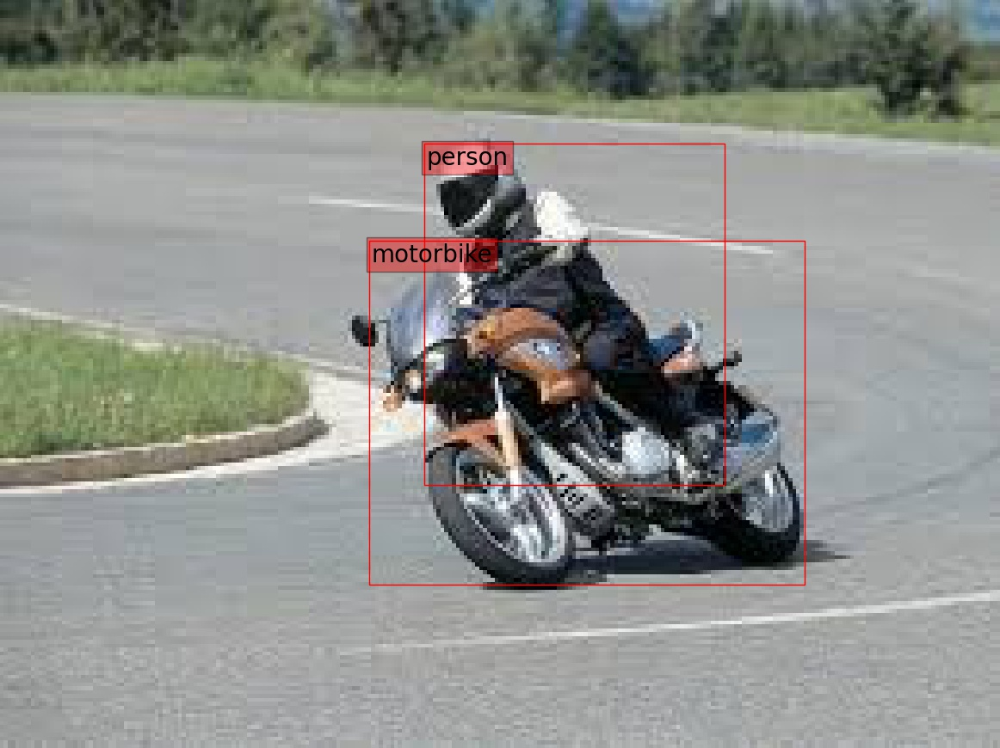

# TensorflowKeras Implementation of Single Shot MultiBox Detector
A pure Tensorflow+Keras Implementation of [SSD (Single Shot MultiBox Detector)](https://arxiv.org/abs/1512.02325) using different backbones of Efficientnet on the PASCAL_VOC dataset.



## Dependencies
1. Python 3.6+
2. Tensorflow 2.2.0+
3. Tensorflow_Datasets 3.0.0+
4. Efficientnet
5. Keras 2.4.0+ (also called 2.3.0-tf)

To install these dependencies, run
```bash
pip install -r requirements.txt
```
## Test on your own images
Add your images to the `inputs/` folder and then run
```bash
python predict.py
```
A pretrained model with EfficientNetB3 backbone will load and run on all images in the `inputs/` folder. The results can be found in the `outputs/` folder.

## NOTE: 
To train or evaluate the model would require downloading the PASCAL VOC dataset and converting it into tfrecords format by `tensorflow_datasets` module. This is done automatically in `train.py` or `eval.py` but requires a considerable amount of time on the first run.

## Evaluate Model
In `eval.py`, change the `checkpoint_filepath` variable to your trained model weights and make sure the base model i.e. `MODEL_NAME` is set according to your architecture ('B0', 'B1'...etc.). Then run
```bash
python eval.py
```
PASCAL_VOC evaluation will be performed on the VOC2007 test dataset.

## Train Model
To train from scratch, run
```bash
python train.py
```
If you want to continue training from a checkpoint set `checkpoint_filepath` and set `base_lr` accordingly.

## Pretrained Models

|     Backbone     |   mAP    | Model Size | Download  |
| :--------------: |:--------:| :--------: | :-------: |
|  EfficientNet-B0 |   74.3   |   24MB    | [model](https://github.com/lufficc/SSD/releases/download/1.2/vgg_ssd300_voc0712.pth)  |
|  EfficientNet-B3 |   76.3   |   49MB    | [model](https://github.com/lufficc/SSD/releases/download/1.2/vgg_ssd512_voc0712.pth)  |
|  EfficientNet-B5 |   77.5   |   117MB   | [model](https://github.com/lufficc/SSD/releases/download/1.2/efficient_net_b3_ssd300_voc0712.pth) |

### EfficientNetB0 SSD (300 x 300)
```
****************************************************************************************************
Average Precisions
{'aeroplane': 0.7800157231291908,
 'bicycle': 0.830080097782427,
 'bird': 0.6972303731738765,
 'boat': 0.6874695492244346,
 'bottle': 0.44450301285192956,
 'bus': 0.7784750741179701,
 'car': 0.8118978656479396,
 'cat': 0.8710704906835629,
 'chair': 0.6031652990795755,
 'cow': 0.7280159632333296,
 'diningtable': 0.7498881454649887,
 'dog': 0.8379743383251255,
 'horse': 0.8337120771431471,
 'motorbike': 0.8194014393196231,
 'person': 0.774534918174515,
 'pottedplant': 0.5322147125048592,
 'sheep': 0.7044521803545073,
 'sofa': 0.7880689464995533,
 'train': 0.8751272977754305,
 'tvmonitor': 0.7190302090784884}
****************************************************************************************************
Mean Average Precision: 0.7433163856782238
```

### EfficientNetB3 SSD (300 x 300)
```
****************************************************************************************************
Average Precisions
{'aeroplane': 0.8138464069658522,
 'bicycle': 0.8495817279095099,
 'bird': 0.7411210589421086,
 'boat': 0.6953653156671167,
 'bottle': 0.44501229699670486,
 'bus': 0.8169842240921157,
 'car': 0.8348353061776034,
 'cat': 0.867478526227363,
 'chair': 0.6359432618499943,
 'cow': 0.7347537326752558,
 'diningtable': 0.7556188461308526,
 'dog': 0.8453690345281261,
 'horse': 0.8431191113749101,
 'motorbike': 0.8414147988740155,
 'person': 0.8000506418143006,
 'pottedplant': 0.5718438091150522,
 'sheep': 0.7248609390832621,
 'sofa': 0.8101149566442967,
 'train': 0.8836348165299509,
 'tvmonitor': 0.7443892209541666}
****************************************************************************************************
Mean Average Precision: 0.762766901627628
```

### EfficientNetB5 SSD (300 x 300)
```
****************************************************************************************************
Average Precisions
{'aeroplane': 0.8402582577317493,
 'bicycle': 0.8611873325373057,
 'bird': 0.7579335634733774,
 'boat': 0.7394833127167081,
 'bottle': 0.47933192495395077,
 'bus': 0.8181464002356922,
 'car': 0.8443131628054835,
 'cat': 0.8799997608338624,
 'chair': 0.6257301589722992,
 'cow': 0.7870176718398668,
 'diningtable': 0.7662971953267264,
 'dog': 0.8378183820936017,
 'horse': 0.8493214449256444,
 'motorbike': 0.8534871863365513,
 'person': 0.8214934259604633,
 'pottedplant': 0.5706558290952545,
 'sheep': 0.7471660716329726,
 'sofa': 0.7908692690722835,
 'train': 0.8834500074371311,
 'tvmonitor': 0.7397631809290843}
****************************************************************************************************
Mean Average Precision: 0.7746861769455005
```

## References
1. https://github.com/qfgaohao/pytorch-ssd
2. https://github.com/lufficc/SSD
3. https://github.com/mvoelk/ssd_detectors